cat > README.md << 'EOF'
# Фитнес-трекер | Проект учебной практики

**Студент:** Щипановский Дмитрий  
**Группа:** 10-23

---

# Часть 1. УП.02 Учебная практика

## Тема проекта
Веб-приложение «Фитнес-трекер: график тренировок и справочник упражнений»

## Актуальность темы
В современном мире многие люди начинают заниматься спортом дома или в зале, но сталкиваются с проблемами: отсутствие системы, непонимание, какие упражнения для каких мышц работают, и как правильно прогрессировать. Разработка простого трекера тренировок с графиком и описанием упражнений позволит пользователю структурировать занятия и отслеживать прогресс.

## Целевая аудитория
- Новички в фитнесе
- Люди, тренирующиеся дома
- Спортсмены-любители

## Функциональные возможности

| Категория | Функция |
|-----------|---------|
| График тренировок | Создание и редактирование недельного графика |
| Справочник упражнений | 20 упражнений с техникой выполнения |
| Фильтрация | По группам мышц |
| Дневник | Запись подходов, повторений, веса |
| Статистика | Прогресс при ≥3 записях |

## Технологии (УП.02)
- HTML5, CSS3 (Flexbox/Grid)
- JavaScript (ES6)
- LocalStorage

## Use-case диаграмма
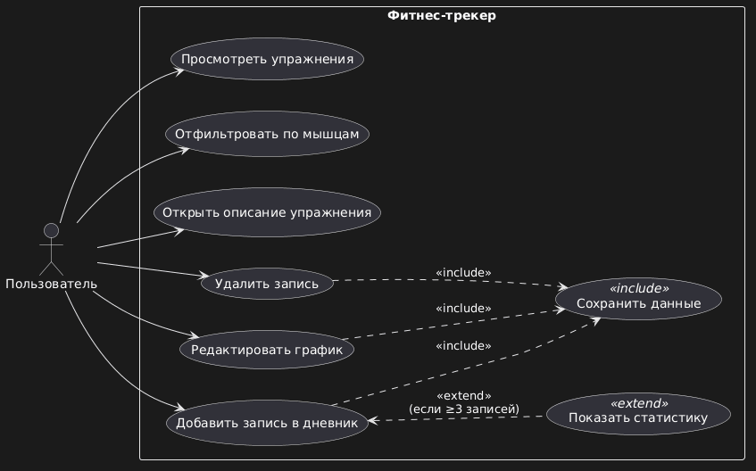

### Акторы
- **Пользователь** — единственный актор

### Use cases

| Use case | Тип |
|----------|-----|
| Просмотреть упражнения | базовый |
| Отфильтровать по мышцам | базовый |
| Открыть описание | базовый |
| Редактировать график | базовый |
| Добавить запись | базовый |
| Удалить запись | базовый |
| Сохранить данные | include |
| Показать статистику | extend (≥3 записей) |

## Скриншоты интерфейса

| Экран | Описание |
|-------|----------|
| 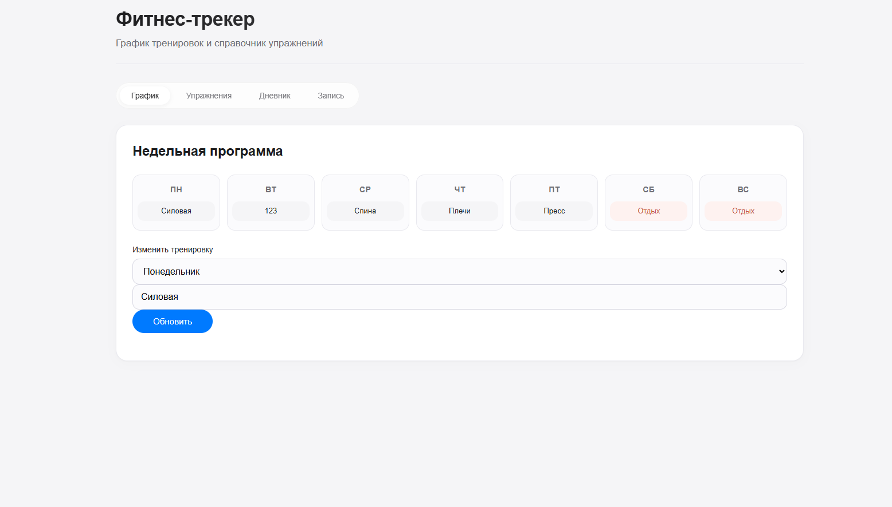 | Недельный график тренировок |
| 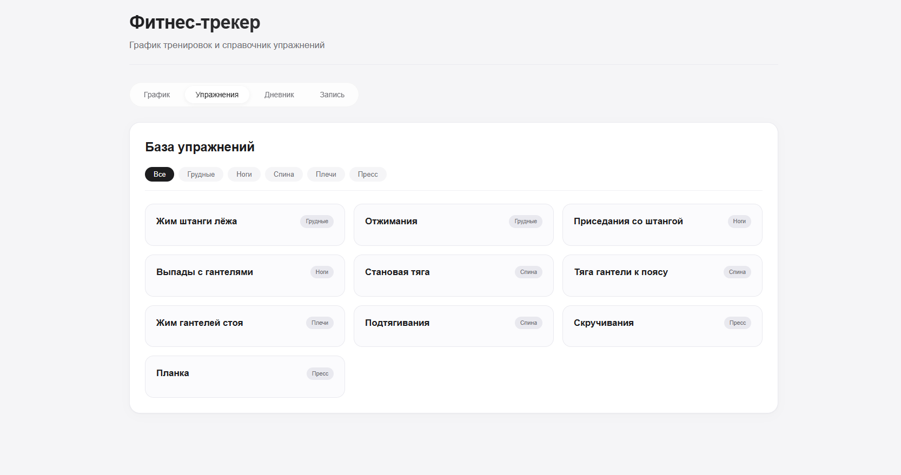 | Справочник упражнений |
| 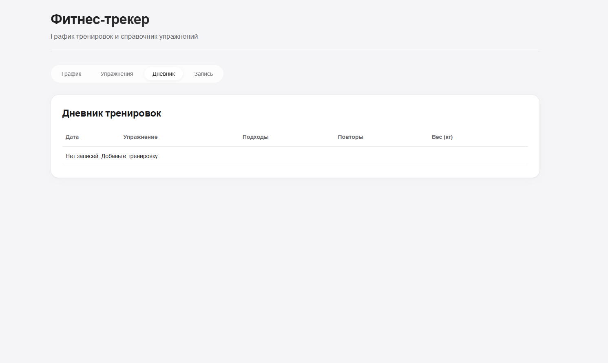 | Дневник и статистика |
| 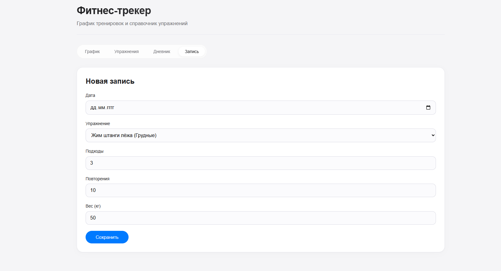 | Форма добавления |

---

# Часть 2. УП.11 Учебная практика

## Тема
Проектирование базы данных и бэкенда для фитнес-трекера

## Структура БД (PostgreSQL)

### Таблицы

| Таблица | Поля |
|---------|------|
| users | id, username, email, password_hash, created_at |
| exercises | id, name, muscle_group, description |
| user_schedule | id, user_id, day_of_week, workout_name |
| workout_logs | id, user_id, exercise_id, log_date, sets, reps, weight_kg |

### Связи
- users → user_schedule: **1 : M**
- users → workout_logs: **1 : M**
- exercises → workout_logs: **1 : M**

### Скриншот структуры таблиц


## SQL-запросы

| № | Тип | Скриншот |
|---|-----|----------|
| 1 | SELECT WHERE (упражнения для ног) | 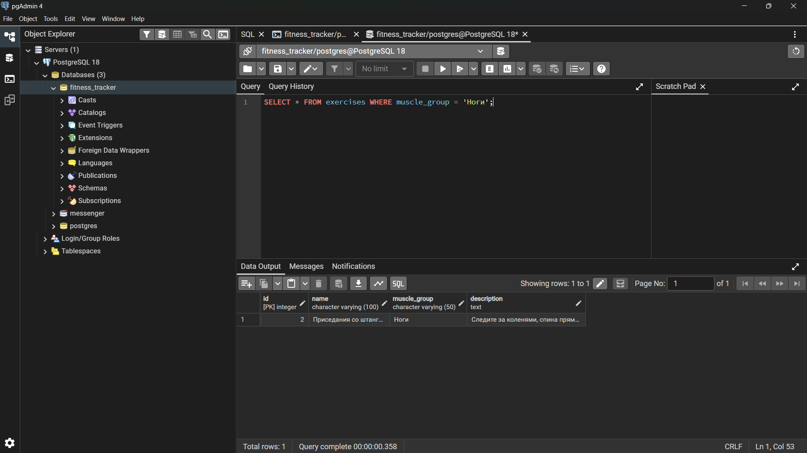 |
| 2 | INSERT (добавить запись) | 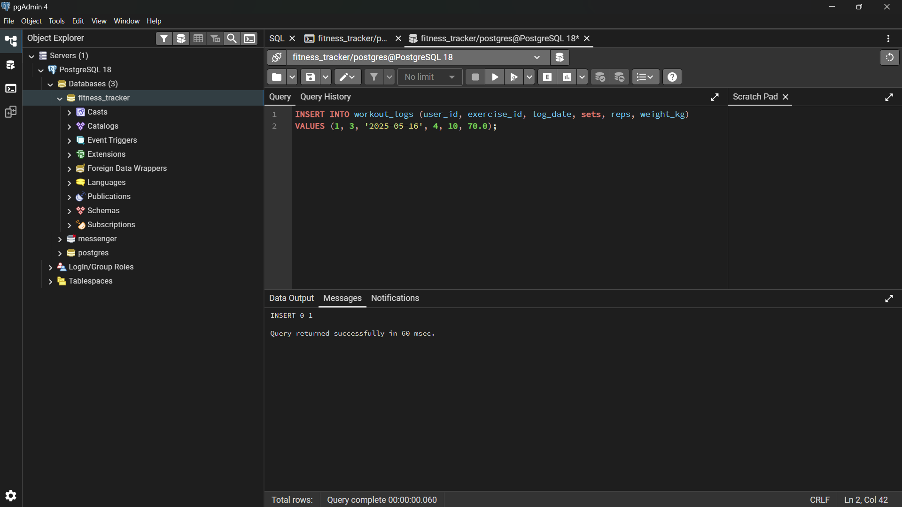 |
| 3 | UPDATE (обновить вес) | 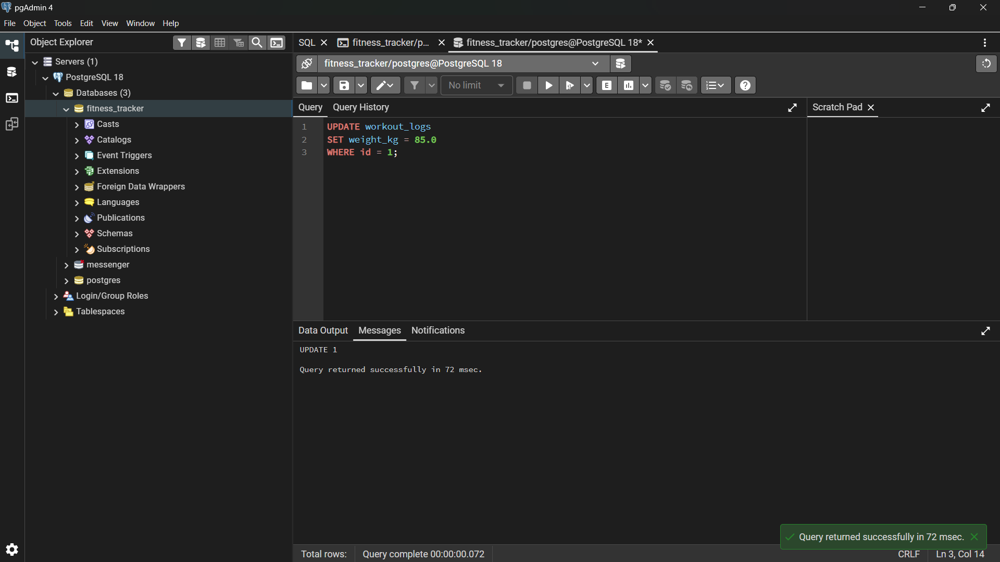 |
| 4 | DELETE (удалить запись) | 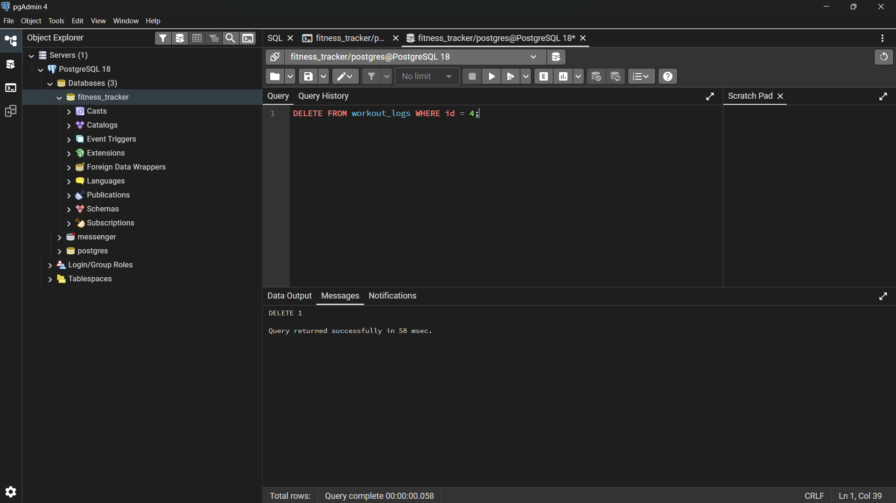 |
| 5 | SELECT JOIN (дневник с именами) | 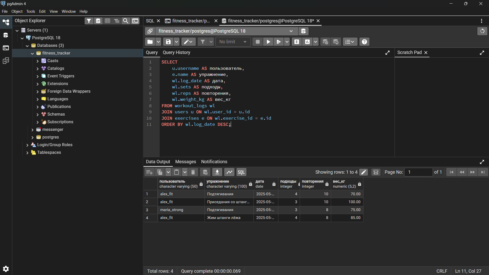 |

## ER-диаграмма
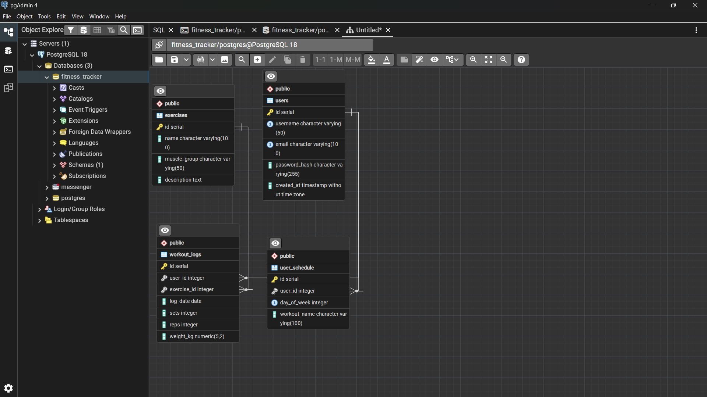

## Бэкенд (Node.js + Express)

### Технологии
- Node.js / Express.js
- PostgreSQL / pg
- JWT (аутентификация)
- bcrypt (хеширование)

### API Endpoints

| Метод | Endpoint | Описание |
|-------|----------|----------|
| POST | /api/register | Регистрация |
| POST | /api/login | Вход |
| GET | /api/exercises | Все упражнения |
| GET | /api/schedule/:userId | График |
| POST | /api/schedule | Сохранить график |
| GET | /api/logs/:userId | Дневник |
| POST | /api/logs | Добавить запись |
| DELETE | /api/logs/:id | Удалить запись |

### Запуск
```bash
npm install
npm run dev
# http://localhost:5000